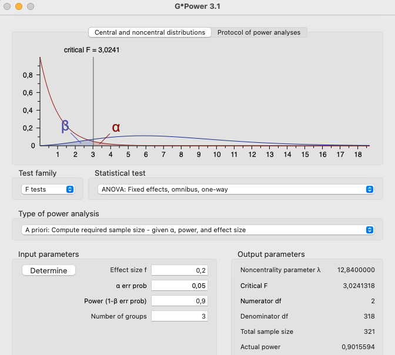

```{r setup, include=FALSE}
options(htmltools.dir.version = FALSE)

setwd("/Users/stephangoerigk/Desktop/Universität/CFH/Lehre/Bachelor/Quantitative Methoden II/VO_Statistik II/Statistik_II_Folien_SS23/")

library(tidyverse)
library(kableExtra)
library(ggplot2)
library(plotly)
library(htmlwidgets)
library(MASS)
library(ggpubr)
library(xaringanthemer)
library(xaringanExtra)

style_duo_accent(
  primary_color = "#621C37",
  secondary_color = "#EE0071",
  background_image = "blank.png"
)

xaringanExtra::use_xaringan_extra(c("tile_view"))

use_scribble(
  pen_color = "#EE0071",
  pen_size = 4
  )

knitr::opts_chunk$set(
  fig.retina = TRUE,
  warning = FALSE,
  message = FALSE
)
```

name: Title slide
class: middle, left
<br><br><br><br><br><br><br>
# Statistik II

### Einheit 2: Einfaktorielle Varianzanalyse (2)
##### 19.04.2023 | Prof. Dr. phil. Stephan Goerigk

---
class: top, left
### Einfaktorielle Varianzanalyse (ANOVA)

.pull-left[

#### Determinanten der ANOVA

* Determinanten = Größen, welche die Signifikanz der ANOVA beeinflussen:

  * Signifikanzniveau $(\alpha)$
  
  * Teststärke $(1-\beta)$
  
  * Effektgröße (Unterschied zwischen Mittelwerten)
  
  * Stichprobengröße $(N)$
  
$\rightarrow$ Wir testen gegen die Nullhypothese $(H_0)$ und verwerfen diese bei einem signifikanten Ergebnis
]
.pull-right[
```{r echo = F}
ggpubr::ggarrange(ggplot(data.frame(x = c(-6, 6)), aes(x = x)) +
    stat_function(fun = dnorm, args = list(-2, 1),
                  aes(colour = "Gruppe 1")) +
  stat_function(fun = dnorm, args = list(0, 1),
                  aes(colour = "Gruppe 2")) +
    ggtitle("t-Test") +
    labs(colour = "") +
  theme_classic() +
  theme(text = element_text(size = 25), axis.text.y = element_blank(), axis.ticks.y = element_blank()),
  ggplot(data.frame(x = c(-6, 6)), aes(x = x)) +
    stat_function(fun = dnorm, args = list(-2, 1),
                  aes(colour = "Gruppe 1")) +
  stat_function(fun = dnorm, args = list(0, 1),
                  aes(colour = "Gruppe 2")) +
    stat_function(fun = dnorm, args = list(2, 1),
                  aes(colour = "Gruppe 3")) +
    labs(colour = "") +
    ggtitle("ANOVA") +
  theme_classic() +
  theme(text = element_text(size = 25), axis.text.y = element_blank(), axis.ticks.y = element_blank()), nrow = 2)
```
]

---
class: top, left
### Einfaktorielle Varianzanalyse (ANOVA)

#### Determinanten der ANOVA

```{r echo = F}
set.seed(123)
df = data.frame(Placebo = rnorm(50, 7, 4),
                `Medikament 1` = rnorm(50, 11, 4),
                `Medikament 2` = rnorm(50, 12, 4))
df = pivot_longer(df, cols = 1:3)
names(df) = c("Gruppe", "Symptome")
df = as.data.frame(df)
df$ID = rownames(df)
```

.pull-left[
##### Exkurs: Beziehung zwischen F-Wert und t-Wert

* Für den t-Test gelernte Konzepte können vollständig auf die Varianzanalyse übertragen werden

* t-Test = Vergleich 2er Mittelwerte $\rightarrow$ entsprich ANOVA mit 2-stufigem Faktor (UV)

**Beispiel aus Einheit 1 (2 Stufen):** 

Vergleich Placebo vs. Medikament 1
]

.pull-right[
.center[
```{r echo = F, out.width = "350px"}
ggplot(df[df$Gruppe == "Placebo" | df$Gruppe == "Medikament.1",], aes(x=Gruppe,y=Symptome)) +
  stat_summary() +
  theme_classic() +
  theme(text = element_text(size = 25))
```
]
]
---
class: top, left
### Einfaktorielle Varianzanalyse (ANOVA)

#### Determinanten der ANOVA

##### Exkurs: Beziehung zwischen F-Wert und t-Wert

```{r}
t.test(Symptome ~ Gruppe, data = df[df$Gruppe == "Placebo" | df$Gruppe == "Medikament.1",], var.equal = T)
```

---
class: top, left
### Einfaktorielle Varianzanalyse (ANOVA)

#### Determinanten der ANOVA

##### Exkurs: Beziehung zwischen F-Wert und t-Wert

```{r}
anova(lm(Symptome ~ Gruppe, data = df[df$Gruppe == "Placebo" | df$Gruppe == "Medikament.1",]))
```

---
class: top, left
### Einfaktorielle Varianzanalyse (ANOVA)

#### Determinanten der ANOVA

##### Exkurs: Beziehung zwischen F-Wert und t-Wert

$$F_{(1; 98)}=\frac{\hat{\sigma}_{zwischen}^2}{\hat{\sigma}_{innerhalb}^2}=\frac{494.62}{13.42}=36.87$$

$$t_{(98)} = 6.0718$$

$$6.0718^2=36.87$$
* Das Quadrat des t-Werts entspricht dem F-Wert einer einfaktoriellen ANOVA mit zwei Stufen

$\rightarrow$ Die Varianzanalyse ist eine Verallgemeinerung des t-Tests

---
class: top, left
### Einfaktorielle Varianzanalyse (ANOVA)

#### Determinanten der ANOVA

##### Effektstärke

<small>
* Das Maß für den Populationseffekt in der Varianzanalyse heißt $\Omega^2$

$$\Omega^2=\frac{\sigma^2_{systematisch}}{\sigma^2_{Gesamt}}$$

* $\Omega^2$ Gibt den Anteil systematischer Varianz an der Gesamtvarianz an

* Schätzer für den Populationseffekt $\Omega^2$ ist $\omega^2$ (klein Omega-Quadrat)

* Die Schätzung erfolgt über $f^2$

$$f^2=\frac{(F_{df_{Zähler}; df_{Nenner}}-1)\cdot df_{Zähler}}{N}$$

$$\omega^2=\frac{f^2}{1+f^2}$$
</small>

---
class: top, left
### Einfaktorielle Varianzanalyse (ANOVA)

#### Determinanten der ANOVA

##### Effektstärke

<small>
```{r out.width = "100px"}
anova(lm(Symptome ~ Gruppe, data = df))
```

$$f^2=\frac{(F_{df_{Zähler}; df_{Nenner}}-1)\cdot df_{Zähler}}{N} = \frac{(20.558-1)\cdot 2}{150}=0.26$$
</small>

---
class: top, left
### Einfaktorielle Varianzanalyse (ANOVA)

#### Determinanten der ANOVA

##### Effektstärke

$$\omega^2=\frac{f^2}{1+f^2}= \frac{0.26}{1+0.26}=0.2063$$
* Der Anteil der Effektvarianz des Faktors Gruppe beträgt 20.63%

* Anders ausgedrückt: der Faktor Gruppe klärt circa 21% der Gesamtvarianz auf

* Dies entspricht einem großen Effekt.

**Konventionen:**

```{r echo=F}
df <- data.frame(Effektstärke = c("Kleiner Effekt", "Mittlerer Effekt", "Großer Effekt"),
                 OmegaQuadrat = c("0.01", "0.06", "0.14"))

names(df) = c("Effektstärke", "Omega-Quadrat")

kable(df[,]) %>%
  kable_styling(font_size = 18)
```

---
class: top, left
### Einfaktorielle Varianzanalyse (ANOVA)

#### Determinanten der ANOVA

##### Effektstärke

* Ein weiteres, häufig verwendetes Effektmaß ist $\eta^2$ (Eta-Quadrat)

* Es gibt den Anteil der aufgeklärten Varianz der Messwerte auf Ebene der Stichprobe an

* Es wird aus dem Verhältnis von Quadratsummen, anstelle von Varianzen berechnet

$$\eta^2=\frac{QS_{zwischen}}{QS_{zwischen} + QS_{innerhalb}}$$
* Berechnung kann ebenfalls über $f^2$ erfolgen (wir schreiben für die Stichprobe $f_s^2$)

.pull-left[
$$f_s^2=\frac{(F_{df_{Zähler}; df_{Nenner}})\cdot df_{Zähler}}{df_{Nenner}}$$
]

.pull-right[
$$\eta^2=\frac{f_s^2}{1+f_s^2}$$

]

---
class: top, left
### Einfaktorielle Varianzanalyse (ANOVA)

#### Determinanten der ANOVA

##### Effektstärke

$$f_s^2=\frac{20.558 \cdot 2}{147}=0.2797$$

$$\eta^2=\frac{0.2797}{1+0.2797}=0.2185$$
* Wert fällt im Vergleich zum wahren Effekt auf Populationsebene zu groß aus (Überschätzung)

* Oftmals liefert $\omega^2$ genauere Schätzung (Daten innerhalb der Stichprobe sind überangepasst)

* Der Stichprobenebene klärt der Faktor Gruppe ca. 22% der Varianz der Messwerte auf

* Konventionen für $\eta^2$ entsprechen denen für $\Omega^2$

---
class: top, left
### Einfaktorielle Varianzanalyse (ANOVA)

#### Determinanten der ANOVA

##### Residualvarianz

* Je kleiner die Residualvarianz, desto größer die Test stärke (Wahrscheinlichkeit, dass Test signifikant wird)

* Schätzung der Residualvarianz durch die Varianz innerhalb steht im Nenner des F-Bruchs $\rightarrow$ bei kleineren Werten wird F-Wert größer

* Die Größe der Residualvarianz wird häufig auch "Rauschen" genannt

Analogie aus der Akustik:

  * Bei lauten Nebengeräuschen sind leise Töne schwerer zu hören
  
  * Das Signal wird vom Rauschen verdeckt

$\rightarrow$ ANOVA: Rauschen = Residualvarianz; Signal = gesuchter Effekt (z.B. Gruppenunterschied)

---
class: top, left
### Einfaktorielle Varianzanalyse (ANOVA)

#### Determinanten der ANOVA

##### Größe des Effekts

* Umso größer der gesuchte Populationseffekt, desto größer die Teststärke

* Je mehr sich die Populationsmittelwerte der Gruppen unterscheiden (systematischer Einfluss auf die AV), desto wahrscheinlicher ist ein signifikantes Ergebnis

* Dies entspricht einem deutlichen Signal, welches auch noch bei starkem Rauschen hörbar ist

---
class: top, left
### Einfaktorielle Varianzanalyse (ANOVA)

#### Determinanten der ANOVA

##### Stichprobenumfang

* Umso größer der Stichprobenumfang, desto größer die Teststärke

**Gründe:**

1. Varianz zwischen

  * Varianz zwischen hängt proportional von der Anzahl der Personen in einer Bedingung ab 

  * Die größer $N$, desto größer die Varianz zwischen (steht im Zähler des F-Bruchs)

  * größere Varianz zwischen $\rightarrow$ größerer F-Wert $\rightarrow$ signifikanteres Ergebnis

2. Freiheitsgrade Varianz innerhalb

  * Erhöhen sich mit steigenden Stichprobenumfang $\rightarrow$ Verkleinerung des kritischen F-Werts (man kommt leichter über die Signifikanzschwelle)

---
class: top, left
### Einfaktorielle Varianzanalyse (ANOVA)

#### Determinanten der ANOVA

##### $\alpha$-Fehler

* Je größer (weniger streng) das a priori festgelegte Signifikanzniveau, desto größer die Teststärke

* Durch die Erhöhung des $\alpha$-Fehlers steigt die Wahrscheinlichkeit die Alternativhypothese fälschlich zu wählen (Fehler 1. Art).

**ABER:**

* Gleichzeitig erhöht sich die Wahrscheinlichkeit, einen Effekt zu finden, falls er wirklich existiert.


---
class: top, left
### Einfaktorielle Varianzanalyse (ANOVA)

#### Determinanten der ANOVA

##### Stichprobenumfangsplanung

* Einer der wichtigsten Schritte vor der Durchführung einer Untersuchung

* Nur so kann gewährleistet werden, dass die Interpretation eines Untersuchungsergebnisses korrekt ablaufen kann

Probleme bei Auslassen der Stichprobenumfangsplanung:

* Stichprobenumfang zu klein. Teststärke ist so klein, dass ein nicht signifikantesergebnis nicht interpretierbar ist (underpowered)

* Stichprobenumfang zu groß. Auch kleine Effekte werden signifikant, die für eine vernünftige inhaltliche Interpretation zu klein sind (overpowered)

---
class: top, left
### Einfaktorielle Varianzanalyse (ANOVA)

#### Determinanten der ANOVA

##### Stichprobenumfangsplanung (in R)

```{r}
pwr::pwr.anova.test(k=3, f= 0.2, sig.level = 0.05, power = 0.9)
```

* Bei Annahme eines Signifikanzniveaus von 0.05 wären für eine ANOVA mit 3 Gruppen und einer großen Effektstärke (0.20) wären für eine Teststärke $(1-\beta)$ von 90% lediglich N=106 Personen zum Nachweisen eines signifikanten Effekts notwendig gewesen.

---
class: top, left
### Einfaktorielle Varianzanalyse (ANOVA)

#### Determinanten der ANOVA

##### Stichprobenumfangsplanung (in GPower)

.center[
```{r eval = TRUE, echo = F, out.width = "470px"}

```
]

---
class: top, left
### Einfaktorielle Varianzanalyse (ANOVA)

#### Post-Hoc-Analysen

---
class: top, left
### Einfaktorielle Varianzanalyse (ANOVA)

#### Voraussetzungen der ANOVA

* ANOVA gehört zur den sog. parametrischen Verfahren (wie auch der t-Test)

Es gelten folgende Voraussetzungen:

1. Die abhängige Variable ist intervallskaliert
  * messtheoretisch abgesichert (muss man wissen)

2. Das untersuchte Merkmal ist in der Population normalverteilt

3. Varianz Homogenität (Varianten sind innerhalb der verglichenen Gruppen ungefähr gleich)

4. Messwerte in allen Bedingungen sind unabhängig voneinander
  * Durch randomisierte Zuweisung der Personen zu den Faktorstufen
  * Falls nicht möglich gegebenenfalls Kontrolle von Störvariablen


---
class: top, left
### Take-aways

.full-width[.content-box-gray[

* **ANOVA** = Verfahren für Hypothesen mit einer intervallskalierten AV und einer mehr als 2-stufigen UV

* ANOVA vergleicht im Vergleich zum t-Test auch **mehr als 2 Gruppen** miteinander.

* Durch **simultanen Mittelwertsvergleich** (Omnibustest) werden $\alpha$ -Fehler-Kumulierung und Reduktion der Teststärke vermieden.

* Prinzip basiert auf der Unterscheidung zwischen **systematischer Varianz** und **unsystematischer Varianz**.

* Signifikanztestung über **F-Test**, der systematische und unsystematische Varianz ins Verhältnis zueinander setzt (F-Quotient).

* **Signifikante ANOVA** zeigt einen Unterschied zwischen Mittwelwerten an, jedoch nicht, zwischen welchen Gruppen dieser genau besteht.

* ANOVA alleine kann **keine gerichteten Hypothesen** prüfen.
]

]


